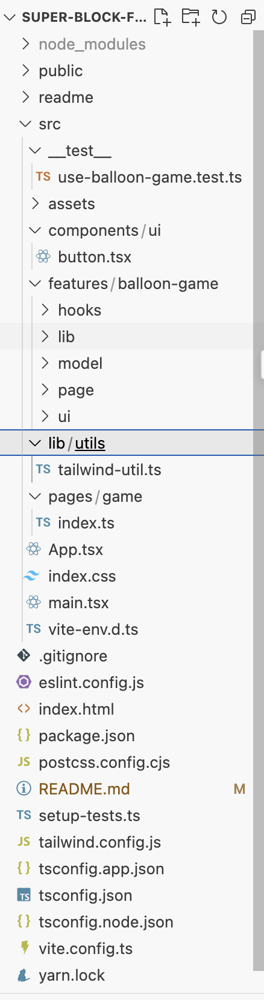
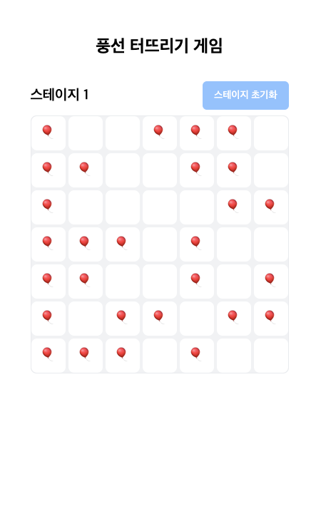
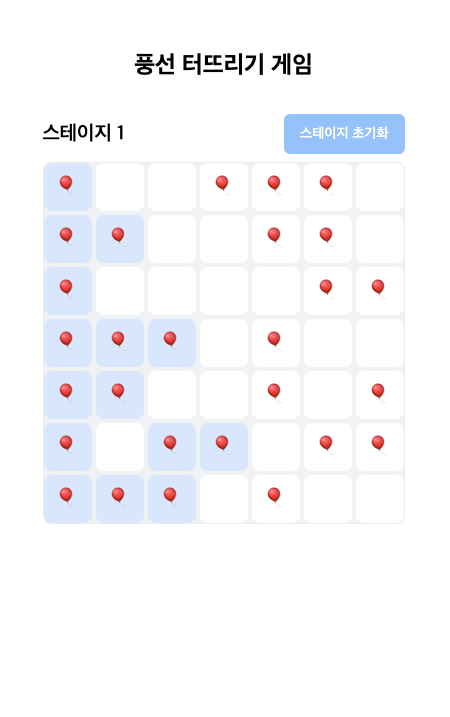
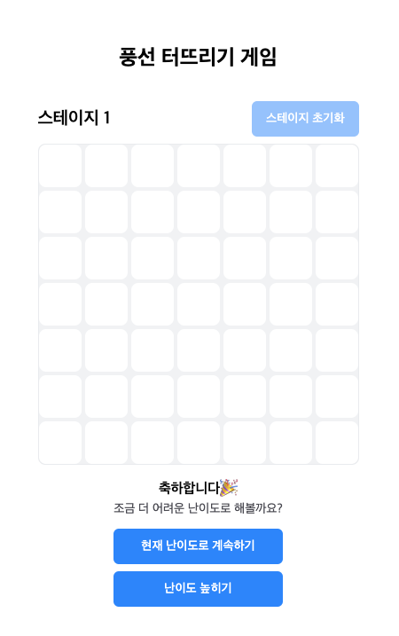

# Super-Block-FE-test

> - 작업자: 김성주
> - 수행일자: 2024.01.07 ~ 2024.01.09

## 🛠 과제 요약

### 내용

2D 격자판에 생성되는 풍선을 가장 많이 인접해 있는 영역부터 터뜨리는 애플리케이션의 구현.

### 과제 풀이 내용

TypeScript 기반의 React.js 구조를 활용해 아래와 같은 기능을 포함하는 웹사이트를 구축하였습니다.

#### [필수 기능]

- **2D 격자 기반의 풍선 블록 렌더링**: 기본 6 x 6 격자의 그리드의 게임판과 풍선 생성
- **큰 블록부터 터뜨리기**: 큰 블록부터 터뜨리는 기능 구현
- **조건에 맞지 않을 시 UI 표출**: 조건에 맞지 않을 시 재시도 UI 표출

#### [추가 기능]

명세에는 없었지만 편의성을 위해 추가한 기능들입니다.

- **Hover 시 같은 블록 표시**: hover 시 같은 영역에 묶이는 영역을 표시해주는 UI를 표기하였습니다.
- **난이도 조절**: 스테이지 기능 도입

## 📂 프로젝트 구조

┣ 📂 \_\_test\_\_ # 테스트코드  
┣ 📂 components # 재사용 가능한 UI 컴포넌트  
┣ 📂 features # 재사용이 명확한 기능 단위의 컴포넌트, 유틸함수, 페이지 등  
┣ 📂 lib # 공통으로 사용하게 될 유틸함수나 설정 등
┗ 📂 pages # 페이지로 사용될 기능들



# 🚀 설치 및 실행

## 1. 필수 사전 준비

- Node.js (v18 이상)
- npm 또는 yarn (yarn 권장. 로컬에선 v1.22.21 사용)

## 2. 설치 및 실행

```bash
# 압축 해제된 디렉토리로 이동
cd 프로젝트_폴더

# 의존성 설치
yarn install
npm install

# 실행 http://localhost:5178 에서 애플리케이션 확인 가능
yarn run dev
npm run dev

```

## 3. 테스트

```bash
# 테스트
yarn test
npm run test
```

## 4. 스크린샷

- 1. 최초 렌더링 시 화면



- 2. 블록에 hover 시 나타나는 UI



- 3. 조건 대로 실행하지 않았을 경우의 UI


- 4. 전부 터뜨렸을 경우의 UI


